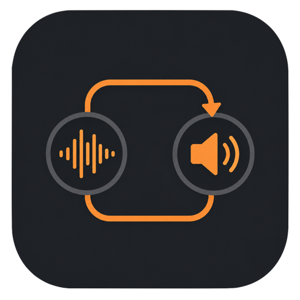

<p align="center">
  
</p>

<h1 align="center">ScreamBar</h1>

<p align="center">
  <strong>Low-latency audio routing for the macOS menu bar.</strong><br>
  Receive Scream network audio, route CoreAudio devices directly, monitor your SteelSeries headset batteries, and wake or shut down a remote machine from one compact application.
</p>

<p align="center">
  macOS 13+ &nbsp;•&nbsp; SwiftUI &nbsp;•&nbsp; CoreAudio &nbsp;•&nbsp; Wake-on-LAN
</p>

<p align="center">
  
</p>

ScreamBar provides four application modes:

- **OFF** stops software audio routing while keeping PC monitoring, Wake-on-LAN, and paired shutdown control available.
- **Scream** receives audio sent over the network by a [Scream](https://github.com/duncanthrax/scream) sender and plays it through JACK.
- **Direct Routing** sends one CoreAudio input device directly to one CoreAudio output device without JACK or network capture.
- **SteelSeries Omni** monitors an Arctis Nova Pro Omni base over USB, showing headset connection and both batteries. The base handles audio; ScreamBar does not route audio in this mode.

Wake-on-LAN and the paired **Host Daemon** shutdown agent are available independently of the selected mode. See [agent setup and pairing](docs/host-daemon.md).

ScreamBar runs as a menu bar-only application and requires macOS 13 Ventura or later.

## Requirements

### Direct Routing mode

Direct Routing uses macOS CoreAudio and has no external runtime dependency. It requests microphone/audio-input permission only when a direct route is started. It does not request Screen Recording or system-audio-capture permission.

For permission testing, run the generated `.app` bundle. A plain `swift run` executable does not include the bundle's microphone usage description.

### Scream mode

Scream mode requires JACK and a Scream Unix receiver compiled with JACK support:

```bash
brew install jack libsoxr berkeley-db@5 libsamplerate cmake pkg-config
```

The release bundle currently includes the receiver and its Homebrew libraries, so `make build` requires a `scream` executable at the repository root even if you only intend to use Direct Routing.

Build the receiver out of tree, using the upstream `JACK_ENABLE` CMake option:

```bash
git clone https://github.com/duncanthrax/scream.git
cd scream

cmake -S Receivers/unix -B Receivers/unix/build \
  -DJACK_ENABLE=ON \
  -DPULSEAUDIO_ENABLE=OFF \
  -DALSA_ENABLE=OFF \
  -DPCAP_ENABLE=OFF \
  -DSNDIO_ENABLE=OFF
cmake --build Receivers/unix/build --parallel

cp Receivers/unix/build/scream /path/to/scream-macos/scream
```

The upstream build can silently disable an unavailable optional output. Verify that the copied executable is linked to JACK before packaging it:

```bash
otool -L /path/to/scream-macos/scream | grep libjack
```

## Build and install

From the repository root:

```bash
# Run the SwiftPM executable for UI or Scream-mode development.
make dev-run

# Create the persistent local signing identity once (stored in ignored project files).
make setup-signing

# Build the release bundle using that same identity.
make build
open .build/release/ScreamBar.app

# Build and install the bundle in /Applications.
make install
open /Applications/ScreamBar.app
```

Release builds use **ScreamBar Local Signing** from an isolated project keychain. The encrypted private key (`.screambar-signing.key`), certificate (`.screambar-signing.crt`), and password (`.screambar-signing.password`) live at the repository root with owner-only permissions. Keep a private backup of these three files together to retain the identity. The `.screambar-signing.keychain-db` file is a rebuildable signing cache containing only this identity; it is not added to the user's keychain search list. All `.screambar-signing.*` files are ignored by Git.

`make build` unlocks and searches only this project keychain. Setup reuses existing material, refuses incomplete or mismatched files, and never silently replaces an identity. Builds fail when the files are missing; they do not generate a new identity or fall back to ad-hoc signing. Moving from an older ad-hoc build requires authorizing the newly signed app once in Accessibility. Subsequent builds retain the same identity; install and launch the app from `/Applications/ScreamBar.app`. This local certificate is for personal builds, not Developer ID distribution or notarization.

The packaging recipe defaults to the Apple silicon Homebrew prefix, `/opt/homebrew`. Override it when Homebrew uses another prefix:

```bash
make HOMEBREW_PREFIX="$(brew --prefix)" build
```

## Usage

Click the main menu bar icon, open **Settings**, and choose **OFF**, **Scream**, **Direct Routing**, or **SteelSeries Omni** from the **Application Mode** menu. Changing the mode stops the previous audio mode before another can start. OFF and SteelSeries Omni never start software audio routing. Settings are saved automatically.

Common controls and behavior:

- For Scream and Direct Routing, the running/stopped state is restored on the next launch. Quit while the selected audio services are running to start them again next time; stop them before quitting to keep them stopped. Launching in OFF or SteelSeries Omni keeps audio routing stopped.
- **Launch at login** registers the application as a macOS login item.
- **Menu Bar** can show the active Direct Routing frame count, app-added
  latency, or both beside the icon. These values are hidden when no running
  route can provide them.
- **Global Shortcut** can use one combined shortcut for audio and Wake-on-LAN, or separate shortcuts for each action. In Scream and Direct Routing, the combined shortcut sends a magic packet when it starts audio; pressing it again stops audio without sending another packet. In OFF and SteelSeries Omni, it sends Wake-on-LAN without starting audio. Wake-on-LAN is skipped when it is disabled.
- **USB Device Trigger** can target audio, Wake-on-LAN, or both when the configured USB device reaches the selected start condition. Its opposite event stops audio only when audio is part of the target; Wake-on-LAN has no inverse stop action. Optional Bash commands run before the selected start actions and after USB-triggered audio shutdown. A failed start command prevents all selected start actions, while a failed stop command is logged without blocking audio shutdown.
- **Wake on LAN** adds a Status action for a configured machine. It accepts a host IPv4 address or an IPv4 subnet in CIDR notation.

### Wake on LAN

Enable **Wake on LAN** in Settings, then enter the target machine's MAC address and its IPv4 address with a prefix, such as `10.2.10.247/16`. A subnet such as `10.2.0.0/16` can be used for broadcast-only waking.

ScreamBar sends six standard magic packets over UDP/9 to the directed broadcast address. It monitors an individual host with ICMP while the menu is visible, and also while the menu is closed in OFF and SteelSeries Omni so the main icon can show PC reachability. Routine background checks retain the previous indicator instead of flashing a checking state. When the host is online, the Status action becomes **Shutdown**, using the Host Daemon HTTPS API after its trust bundle has been imported. A valid agent response also establishes reachability when ICMP is blocked.

Shutdown uses a 3-second countdown and offers cancellation before native dispatch. Pairing is required by default on new agent installations; per-client keys are stored in the macOS Keychain. Pending actions continue to be followed when the menu closes, and an accepted shutdown keeps the action blocked until a new agent instance is verified. USB triggers and keyboard shortcuts retain their existing WOL/audio behavior.

See [Host Daemon setup, pairing and shutdown behavior](docs/host-daemon.md). The target network and machine firmware/operating system must support Wake-on-LAN; some routers block directed broadcasts.

### SteelSeries Omni

Select **SteelSeries Omni** and connect the Mac to **USB1** on the **SteelSeries Arctis Nova Pro Omni** base. Status shows:

- whether the headset is connected to the base;
- the base's current volume, above the battery rows;
- the headset battery percentage;
- the spare battery percentage reported by the base's charging slot.

A separate **headphones + percentage** item appears in the menu bar only in this mode, white on the active display and light gray on an inactive display. Move it independently with **Command-drag**. Clicking it opens the battery popup; clicking outside closes it. The main application icon remains available for settings and PC status.

Status is read every five seconds in the background, without SteelSeries GG and without changing the base's audio settings. If the headset disconnects, its old battery percentage is hidden. Unavailable values appear as `—`, and a missing or unresponsive base is reported explicitly. Monitoring pauses during sleep and stops when another mode is selected.

**Volume + / − and Mute keys** control the base's hardware volume while Omni mode is active, the headset is connected, and Omni is the Mac's default sound output. Click **Allow volume keys…** in Status or the headset popup and enable ScreamBar in **System Settings → Privacy & Security → Accessibility**. Each press moves one hardware step (about 1.8 percentage points); holding a key repeats. Rapid presses are combined without dropping their effect, including changes of direction at the volume limits. The displayed percentage follows key presses immediately and is checked against the base after the burst. Accepted keys also show a compact macOS-style volume indicator near the upper-right corner of the screen containing the pointer; it disappears 1.5 seconds after the last press without taking focus or adding USB polling. ScreamBar reads the current volume at the start of each key sequence, then sends changes using the last successfully written value. It verifies the result after 150 ms without a new press; this quiet interval delays only verification, never writes. Dial changes are picked up at the start of the next sequence. Holding a key at 0% or 100% sends no redundant volume commands. Both views share one volume refresh about once a second while visible; closing them stops volume polling. Battery status is still checked every five seconds in Omni mode. Unchanged values do not trigger interface updates. USB operations run in the background, with at least 50 ms between commands; pending adjustments are cancelled when the mode or output changes. The macOS Control Center volume slider is not handled by this feature. It changes no audio routing and adds no audio processing latency.

**Mute** is intercepted before macOS handles it, avoiding the native mute/unmute loop. It sets the base volume to 0%; pressing Mute again restores the previously read volume. Holding Mute toggles only once. Volume + / − leaves mute and adjusts from zero. The popup and volume indicator show the muted state. A physical dial change to a nonzero value clears it. An unknown initial 0% never restores an invented volume, and leaving Omni mode, changing output, or disconnecting clears the saved restore value. Temporary USB failures preserve a known restore value and keep eligible keys intercepted, with a one-second pause before another keyboard operation. Queued actions and error logs are bounded.

The USB status request and hardware volume read/write have been validated on USB1. USB2 is detected, but did not return status during testing; the application asks you to use USB1. This integration is specific to the **Arctis Nova Pro Omni**, not a claim of support for other SteelSeries headsets. It does not switch macOS audio devices or control ANC or ChatMix.

### Scream

The Status tab controls JACK and the Scream receiver individually or together. Settings include:

- multicast or unicast reception;
- the UDP port used in unicast mode (4010 by default);
- an optional JACK nominal sample rate;
- an optional JACK buffer size from 64 to 2048 frames;
- whether the main toggle controls only Scream or both Scream and JACK.

`---` leaves the corresponding JACK value at the `jackd` default. JACK audio changes apply on its next start.

The Scream receiver listens for network audio. On first use, allow incoming connections if the macOS firewall prompts for the bundled `scream` executable. The firewall permission is only relevant to Scream mode.

If JACK is already running, ScreamBar detects it and does not take ownership of that external process.

### Direct Routing

Select an input, an output, and a buffer policy, then start Direct Routing from the Status tab.

For implementation details, latency accounting, runtime metrics, teardown rules, and the debugging/soak-test playbook, see [Direct Routing architecture](docs/direct-routing.md).

The first output choice is **System Default**. An explicitly selected output is stored by CoreAudio device UID. If it disconnects, ScreamBar temporarily routes to the current system default and returns to the preferred output when it becomes available again. The saved preference is not overwritten by the fallback. Fallback only applies when the preferred output is unavailable. An explicitly selected input does not silently fall back; the route waits for that input to return.

Available buffer choices are **Automatic**, 16, 32, 64, 128, 256, 512, 1024, and 2048 frames:

- **Automatic** leaves synchronized routes at the devices' current buffer sizes. When asynchronous sample-rate conversion is required, it starts with the smallest common supported tier from 16, 32, 64, 128, 256, and 512 frames. It can rebuild at the next tier after a persistent route disruption.
- An explicit value must be supported by both devices. ScreamBar applies and verifies it before starting, then restores the previous values when the route stops unless another client changed them in the meantime.
- Smaller buffers can reduce the CoreAudio portion of latency but increase the risk of dropouts. If an automatic tier is rejected during configuration, ScreamBar tries the next tier. Bluetooth transport latency remains independent of this setting; Automatic is recommended for Bluetooth devices.

When `Automatic` is selected, the **Sensitivity** control chooses how runtime incidents affect the buffer ladder:

- **Strict** increases the buffer after the first actionable incident.
- **Relaxed** (default) tolerates up to three recovered disruption episodes in a rolling 10-second window and increases the buffer on the fourth. All low-level counter increments in one uninterrupted burst belong to the same episode. One monitor interval (approximately 500 ms) without a new incident closes the episode. An episode that remains continuously active for two seconds is treated as persistent instability and increases the buffer without waiting for four separate episodes.

Changing sensitivity while Direct Routing is running updates the monitoring policy immediately without rebuilding the audio route.

Bluetooth outputs follow the same generic CoreAudio negotiation path and are best-effort. No Bluetooth-specific workaround is applied.

#### Automatic sample-rate negotiation and conversion

There is no manual sample-rate setting for Direct Routing. When the input and output support a common hardware nominal rate, ScreamBar chooses it deterministically in this order:

1. the output device's active nominal rate, if supported by the input;
2. 48 kHz;
3. 44.1 kHz;
4. another common rate in deterministic order.

When no common nominal rate exists, ScreamBar keeps both devices at valid native rates and automatically converts between them. For example, a 48 kHz S/PDIF receiver can route to a 44.1 kHz Bluetooth output without changing either device to an unsupported rate. The running status displays both rates when conversion is active.

The output device remains the timing master. Conversion uses Apple's Varispeed audio unit at high quality, a preallocated lock-free single-producer/single-consumer buffer, and adaptive clock correction. The audio render callbacks allocate no memory, acquire no locks, and emit no logs. The adaptive correction is required because two physical devices have independent clocks; fixed-ratio sample-rate conversion alone would eventually underrun or overflow.

The converter targets no more than 5 ms of app-added latency. Its FIFO may grow only as needed within a 10 ms low-latency ceiling to absorb callback phase, clock drift, and scheduling jitter. If a device combination cannot operate reliably inside that ceiling, ScreamBar uses the existing last-resort fallback and displays its calculated latency instead of a fixed estimate. This value excludes latency inside the physical input, output, codec, or Bluetooth transport.

Automatic mode also monitors callback allocation-limit violations, callback deadline misses, underruns, overflows, and FIFO resynchronization. Sensitivity is evaluated outside the real-time callbacks from monotonic incident counters. A disrupted converted route is rebuilt at the next buffer tier actually supported by both devices when the selected sensitivity threshold is reached. A callback quantum larger than the requested device buffer is included in latency accounting but is not, by itself, treated as a route failure. If no safer shared tier exists, the route stops with a contextual error instead of retrying unsupported sizes. Route logs include the configured buffer policy, effective tier, sensitivity, and semantic incident reason.

#### CoreAudio behavior

For a full-duplex physical device, Direct Routing uses one AUHAL bound directly to that device. For different devices that share a nominal rate, it creates a process-private Aggregate Device, keeps the output as its master clock, and enables drift compensation only for the input subdevice. If the devices have no common nominal rate, Direct Routing instead uses one input AUHAL and one output AUHAL with the automatic asynchronous converter between them; no Aggregate Device is created for that route.

The route remains in shared mode:

- it does not request Hog Mode or exclusive access;
- it does not change the macOS system default output;
- other clients such as music and voice-chat applications can continue to use the physical output.

The synchronized playthrough uses one AUHAL in one clock domain, with input IO on element 1 and output IO on element 0. It prefers the native AUHAL software-playthrough connection with a deterministic Float32 client PCM format. CoreAudio may convert normal PCM representation or interleaving, but the client format uses the negotiated hardware rate. The asynchronous path uses separate deterministic Float32 formats at the input and output native rates, with conversion performed explicitly between them.

Device, default-device, alive/hot-plug, nominal-rate, buffer, and stream changes are monitored, and every change still refreshes the published CoreAudio inventory and hardware revision. Direct Routing rebuilds only when the effective input, output, channel layout, alive state, fallback state, or nominal rate changes. Connecting a non-default audio device while `System Default` still resolves to the same output does not rebuild the active route. The same applies to an unused HDMI display and to volatile buffer/capability metadata on a route that is already running. A system-default output change is also ignored while an available explicit output remains effective; it does rebuild a `System Default` route or an explicit-output fallback when the effective output actually changes.

CoreAudio can briefly pause callbacks while macOS enumerates unrelated hardware. ScreamBar keeps the existing route open during that interruption, lets the preallocated FIFO recover, and checkpoints the cumulative stability counters after a short settling window. The raw counters remain available for diagnostics, but the already-observed interruption cannot permanently force Automatic from 64 to 128 or 256 frames. A new instability after recovery is still actionable. Losing an explicit output, following a changed fallback, restoring the preferred output, or changing an active endpoint's nominal rate, channels, or alive state performs a complete stop, AUHAL disposal, Aggregate Device destruction, resolution, renegotiation, rebuild, and restart. A running Aggregate Device is never mutated in place.

## Status and logs

The Status tab reports stopped, starting, running, reconfiguring, waiting, and error states as appropriate for the selected mode.

The main icon is a speaker in Scream and Direct Routing, and a Mac Pro symbol in OFF and SteelSeries Omni. Green indicates running audio or an online PC, gray stopped audio or an offline PC, orange a pending or unknown state, and red an error. The separate headset indicator displays the headset battery percentage, with the same display-dependent tint for its icon and text.

The Logs tab contains timestamped application, JACK, Scream, Direct Routing, and WOL messages. Its source menu can show all messages or any subset of those sources. **Copy** copies all retained entries matching the current filter, including timestamps. **Clear** removes the in-memory entries; cleared messages are not included in later copies. Headset connection and error messages use the App source and are rate-limited; routine battery polls are silent.

Detailed routing diagnostics are written to `~/Library/Logs/ScreamBar/routing-diagnostics.log`, with one active file and two rotated archives, each capped at 1 MB. Writes use a bounded queue outside audio callbacks. The file records callback timing, FIFO behavior, and observed CoreAudio recovery context; correlation with a hardware event does not prove that macOS caused an audio loss. Clearing the Logs tab does not delete these diagnostic files.

ScreamBar stops active audio resources before system sleep and rebuilds the previously running mode after wake. Direct Routing also rebuilds when an effective device or hardware format changes.

### Routing format and latency

When Direct Routing is running, Status shows the selected input and output's physical CoreAudio stream format, including sample rate, channels, and bit depth or sample representation. It also shows the deterministic Float32 non-interleaved client format used by ScreamBar. The Direct Routing log includes the complete physical `AudioStreamBasicDescription` (ASBD), including format ID, flags, bytes per frame, and packet sizing, so DAC, ADC, USB, and S/PDIF issues can be diagnosed without guessing.

`App-added latency` is not hardware end-to-end latency. A reported value such as `≈ 4 ms` includes only ScreamBar's own buffering and sample-rate conversion. It excludes the source machine or Windows audio stack, network transport, USB transport, USB-to-S/PDIF or S/PDIF-to-USB conversion in an adapter such as Cubilux, and the output device's hardware, codec, or Bluetooth radio latency. The complete PC-to-headphones delay can therefore be much higher than the value shown by ScreamBar.

## Tests

Run unit and contract tests with:

```bash
swift test
```

CoreAudio hardware integration tests are opt-in because they open real input/output devices and temporarily exercise supported buffer settings. Quit ScreamBar first so it does not own a competing route, grant microphone permission to the process running the tests if macOS asks, then run:

```bash
SCREAMBAR_RUN_COREAUDIO_INTEGRATION_TESTS=1 \
  swift test --filter CoreAudioCoexistenceIntegrationTests
```

The automatic converter has a separate hardware test. By default it looks for `Cubilux SPDIF Receiver` and `Bose QC 45`; override either name for another incompatible pair:

```bash
SCREAMBAR_RUN_COREAUDIO_INTEGRATION_TESTS=1 \
SCREAMBAR_ASYNC_SRC_INPUT_NAME="Cubilux SPDIF Receiver" \
SCREAMBAR_ASYNC_SRC_OUTPUT_NAME="Bose QC 45" \
SCREAMBAR_ASYNC_SRC_SOAK_SECONDS=60 \
  swift test --filter CoreAudioAsyncSRCIntegrationTests
```

The Cubilux TX/RX loopback latency test bypasses Direct Routing. It sends a
deterministic chirp through `USB SPDIF Adapter`, captures
`Cubilux SPDIF Receiver`, and uses sample correlation plus CoreAudio host
timestamps to measure the complete loop. It never changes the system defaults,
Hog Mode, hardware sample rates, or hardware buffer sizes. Quit ScreamBar and
connect TX → TOSLINK → RX before running it:

```bash
SCREAMBAR_RUN_CUBILUX_LOOPBACK_TESTS=1 \
  swift test --filter CoreAudioCubiluxLoopbackIntegrationTests
```

Override device names, UIDs, or the iteration count with
`SCREAMBAR_CUBILUX_LOOPBACK_INPUT_NAME`,
`SCREAMBAR_CUBILUX_LOOPBACK_OUTPUT_NAME`,
`SCREAMBAR_CUBILUX_LOOPBACK_INPUT_UID`,
`SCREAMBAR_CUBILUX_LOOPBACK_OUTPUT_UID`, and
`SCREAMBAR_CUBILUX_LOOPBACK_ITERATIONS`. The JSON report is written beside the
CoreAudio soak reports. Its latency is explicitly the observed
**Mac CoreAudio output → Cubilux TX → TOSLINK → Cubilux RX → Mac CoreAudio
input** path; it includes CoreAudio/HAL and USB buffering and is not the
intrinsic optical-conversion latency alone.

The simulated converter soaks are opt-in and can be run independently. The value is a wall-clock duration in seconds:

```bash
SCREAMBAR_ASYNC_SRC_TIMING_SOAK_SECONDS=300 \
  swift test --filter testAdaptiveCallbackMatrixDuringRequestedSoak

SCREAMBAR_ASYNC_SRC_QUALITY_SOAK_SECONDS=300 \
  swift test --filter testAdaptiveRoutingQualityDuringRequestedSoak

SCREAMBAR_ASYNC_SRC_FALLBACK_QUALITY_SOAK_SECONDS=300 \
  swift test --filter testFallbackRoutingQualityDuringRequestedSoak

SCREAMBAR_ASYNC_SRC_PERFORMANCE_SOAK_SECONDS=300 \
  swift test --filter testConversionMatrixKeepsRealtimePerformanceHeadroomDuringRequestedSoak
```

Use `60`, `300`, `900`, `1800`, or `3600` seconds for the standard 1, 5, 15, 30, or 60 minute stages. Run the shorter stages first; the long hardware soak is intended only after the regular suite and simulated stages pass.

The regular suite covers rate planning, independent-clock drift up to ±1000 ppm, jitter and burst simulation, lock-free buffer behavior, pitch/gain/SNR, IO topology, callback deadlines, and stream-format contracts. The hardware suites cover both playthrough paths, the complete Direct Routing service lifecycle, cleanup, explicit buffer application and restoration, preservation of the default output and Hog Mode state, and concurrent use by a normal macOS audio client. A hardware-dependent test is skipped when the requested devices or capabilities are unavailable.

The final one-hour CoreAudio matrix is separately opt-in. It covers a stable
converted route, prolonged silence followed by audio resume, high CPU load,
System Default output changes, Cubilux disconnect/reconnect, and a
48 kHz → other state → 48 kHz cycle. The last four require an operator; run all
hardware scenarios sequentially after quitting ScreamBar.

```bash
SCREAMBAR_RUN_COREAUDIO_LONG_SOAK_TESTS=1 \
SCREAMBAR_ASYNC_SRC_INPUT_NAME="Cubilux SPDIF Receiver" \
SCREAMBAR_ASYNC_SRC_OUTPUT_NAME="Bose QC 45" \
SCREAMBAR_ASYNC_SRC_SOAK_SECONDS=3600 \
  swift test --filter testOneHourNormalConvertedRoute
```

Each run writes a JSON report under `.build/coreaudio-soak-reports` with
aggregate FIFO fill, SRC ratio, observed latency, configured latency ceiling,
callback gap/execution time, rebuild, error, underrun/overrun, and
execution-deadline telemetry. Intentional interruption scenarios classify
earlier-session health events separately and require the recovered final
session to be clean. The callback accumulates the new statistics without
locks, allocations, or logging and publishes one coherent atomic snapshot
every 64 output callbacks. See
[Direct Routing architecture](docs/direct-routing.md#one-hour-scenario-matrix)
for every command, operator instruction, environment override, metric
definition, and real-time telemetry constraint.

## Troubleshooting

### Audio-input permission is denied

Enable ScreamBar under **System Settings → Privacy & Security → Microphone**, then start Direct Routing again. Use the `.app` bundle rather than `swift run` when validating permission behavior.

### Sample-rate conversion is active

This is expected when the input and output have no hardware nominal rate in common. ScreamBar displays the input and output rates and converts automatically. Conversion itself is sub-millisecond on supported Apple hardware, but at least one device buffer is required to bridge independent clocks. ScreamBar targets 5 ms of app-added latency, permits an adaptive stability margin up to 10 ms, and reports a calculated fallback value when that ceiling cannot be maintained. Bluetooth codec/transport latency is independent and usually much larger.

### A buffer size is unsupported or cannot be configured

Choose **Automatic** or another frame count supported by both devices. Very small values are not available on every device and can be rejected while another audio client is active.

### A preferred device is unavailable

An unavailable preferred output uses **System Default** temporarily and is restored automatically when it returns. An unavailable explicit input remains selected and Direct Routing waits for it instead of capturing a different input.

### Bluetooth latency is still high

The frame setting only changes CoreAudio buffering where the device permits it. It cannot remove the latency introduced by the Bluetooth transport and codec. Use a wired, USB, or built-in output when consistently low monitoring latency is required.

## License

See [LICENSE](LICENSE).
